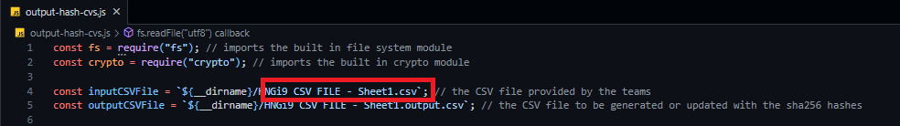

# SHA256 HASH TO CVS ROWS ⚙

## Description
Takes the CSV provided by the teams, and generates a CHIP-0007 compatible json, calculates the sha256 of the json file and append it to each line in the csv (as `HNGi9 CSV FILE - Sheet1.output.cvs`)

## Sample of the CHIP-0007 JSON generated for each row
```
{
  "format": "CHIP-0007",
  "name": "adewale-the-amebo",
  "description": "Adewale likes to be in everyone's business. ",
  "minting_tool": "TEAM BEVEL",
  "sensitive_content": false,
  "series_number": "1",
  "series_total": 420,
  "attributes": [
    {
      "trait_type": "hair",
      "value": "bald"
    },
    {
      "trait_type": "eyes",
      "value": "black"
    },
    {
      "trait_type": "teeth",
      "value": "none"
    },
    {
      "trait_type": "clothing",
      "value": "red"
    },
    {
      "trait_type": "accessories",
      "value": "mask"
    },
    {
      "trait_type": "expression",
      "value": "none"
    },
    {
      "trait_type": "strength",
      "value": "powerful"
    },
    {
      "trait_type": "weakness",
      "value": "curiosity"
    }
  ],
  "collection": {
    "name": "Zuri NFT Tickets for Free Lunch",
    "id": "b774f676-c1d5-422e-beed-00ef5510c64d",
    "attributes": [
      {
        "type": "description",
        "value": "Rewards for accomplishments during HNGi9."
      }
    ]
  }
}
```
## Preview of the `HNGi9 CSV FILE - Sheet1.output.cvs` file


## Usage
- Paste the CSV file in the root directory.
- Replace `HNGi9 CSV FILE - Sheet1.cvs` on *line 4* of `output-hash-cvs.js` with the name of the CSV file (don't forget the .csv extension).

- With reasonably latest version of [Node](https://nodejs.org/en/download/) installed, run 
```bash
node .\output-hash-cvs.js
```
- A CSV file, `HNGi9 CSV FILE - Sheet1.output.cvs` will be generated or updated with the sha256 hash at the end of each row. 

An [HNGi9](https://internship.zuri.team/hngi9) backend task.

Built using Node.js

## Deployment N/A
